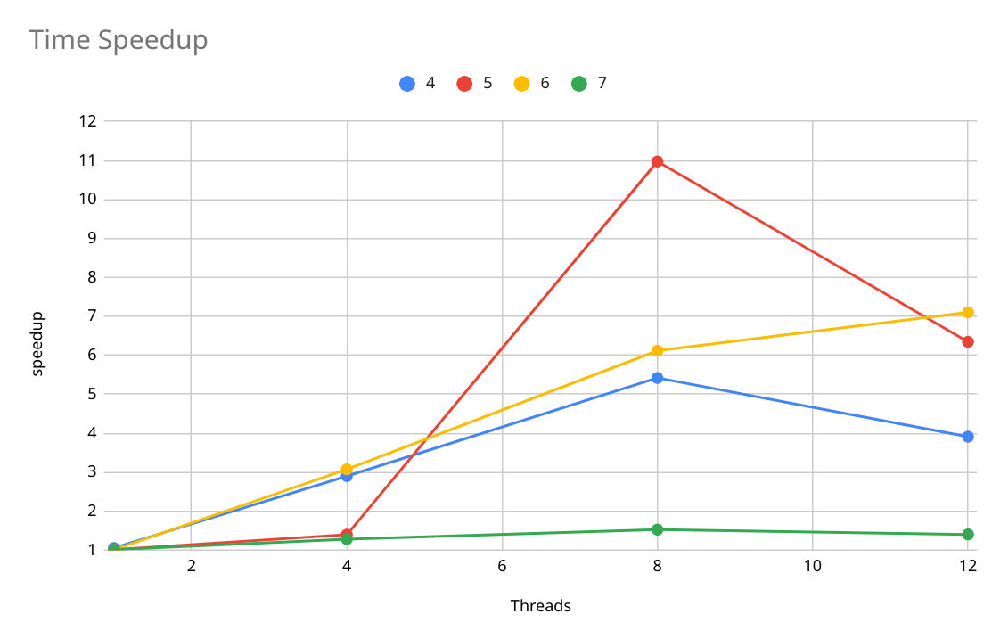
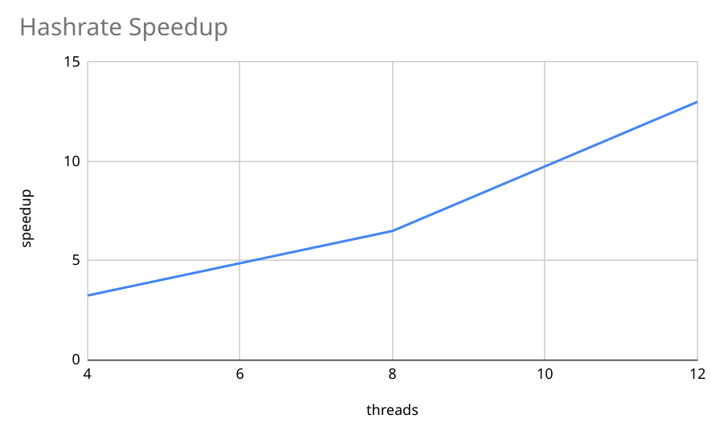

# Report

This was specifically for MPCS 52060 grading.
For this report, I'm assuming a significant difficulty on the blockchain

## The problem

As described in the `README`, this project goal is to create a simplified version of a blockchain with a miner.

Mining blocks is a very well known problem which uses lots of computational process. It is also a great way of showing the impact of parallelism on non-deterministic problems.

## Parallel solution

First, please make sure to read the  `README` to have a general idea of the project and mining algorithm.

There are three main parallel components:

1. MiningPool
2. Miner
3. GPU

### MiningPool

The MiningPool manages multiple miners working on the same blockchain.
It starts with a list of transactions to be processed and stores them on a `Parallel Queue`, which will be read by miners.

The Pool will spawn N miners. Each one of them will read up to 5 transactions from the queue and start their mining process. After finding a valid block, the miner will try to get more transactions and start again.

A barrier is used to sync all miners, so the Pool will only return when all miners finish their job.

In case some transactions weren't able to be mined, the pool will try to shuffle them around and change the number of transactions each miner can read at a time. Then, miners will try to find blocks again. This process is done only a limited amount of times so it doesn't end on a infinite loop.

### Miner

As described in the algorithm, miners will first permute the transactions it got from the queue and then divide max Uint32 into N chunks, spawning N routines.

Each routine will test hashes while changing the nonce inside its chunk, until a valid hash is found or its chunk ends.

Again, we have a barrier here which waits for all routines to end before returning or trying the next permutation.

Since multiple miners are in play and someone may have already found a block, the miner verifies if its block could be added to the blockchain, if not (which means another block was inserted before it could finish), it will start the process again with updated parameters.

### GPU

To improve performance, I developed a GPU version of the mining algorithm. When using this option, the Miner will call the GPU code and the GPU will return a nonce.
The process is basically the same as the goroutines, the GPU will check all possibles nonces for a permutation and let the miner permute/add the block to the blockchain.

## Challenges

A big challenge here is **randomness**. Since the process deals with a double SHA256 hash, its outcome is unpredictable and the same input can return different (correct) results.
The parallelization is pretty straightforward, I believe that the complexity of the system comes with the algorithm implementation.

# Timing Analysis

## Hotspots / Bottlenecks

Clearly, the hotspot of the program is the `Miner.findNonce` function, which runs a loop 4294967295 times (in case no block is found). It can be also called 120 times for a list of 5 transactions.

Even though it is parallelized in the program, it could still run very slowly since we are dealing with randomness. This is a kind of bottleneck which can't be actually removed, but it had a good speedup for with increasing difficulty on the blockchain.

## Limitations

Since the problem works with such large numbers, I believe that the limitation here is the computational power. As I said above, the program deals with a very large number of iterations and since the problem does not have a set solution (we are trying to find one), the only way to speedup is to add more and more cores.

## Analysis

All the data for the following analysis can be found in this [Google Sheets](https://docs.google.com/spreadsheets/d/1epQWdwLaP-jxXqm2e808xV0r0IHABPaDr4YaIKr87lE/edit?usp=sharing). To generate this output, you can run `benchmark.bash`. **This may take a long time depending on how many cores you run**

### System Specifications

| Component | Val |
|--|--|
| CPU | Intel(R) Xeon(R) Silver 4110 CPU @ 2.10GHz |
| RAM | 64GB |
| OS | Linux |
| Cores | 8 (16 with hyper threading) |
| GPU | GeForce GTX 1080 Ti |

### Running time

First, I ran a simple benchmark on how long it takes to mine blocks in certain difficulties. Here is the configuration:

| Difficulty | Blocks |
|--|--|
| 4 | 4 |
| 5 | 3 |
| 6 | 2 |
| 7 | 1 |

Then, the program was run with 0, 1, 4, 8 and 12 threads, generating the following speedup graph:

As you may see, it does not follow a strictly increasing pattern, which is expected, since the problem has multiple answers and some configuration of blocks may lead a thread to start in a nonce which is closer to a solution.
But, even if it does not always improve with more threads, it is clear that some level of parallelism does help.

### Hashrate

More interesting to this problem than running time is the hashrate (i.e. how may nonce we can try per second).
For this benchmark, I ran only the `findNonce` part of the program with 0, 4, 8 and 12 threads. Each run tried `1024*1024` nonces, then I divided that by the time it took to run and there is the hashrate.

This produced the following graph:

As expected, when we increase the number of threads, the hashrate also increases (almost linearly). This is a great indicator for the miner, because it means it will test more nonces. This is useful with blockchains with a bigger difficulty.